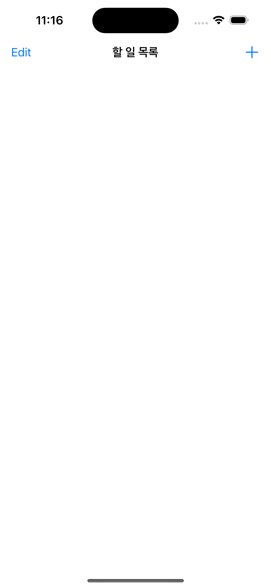
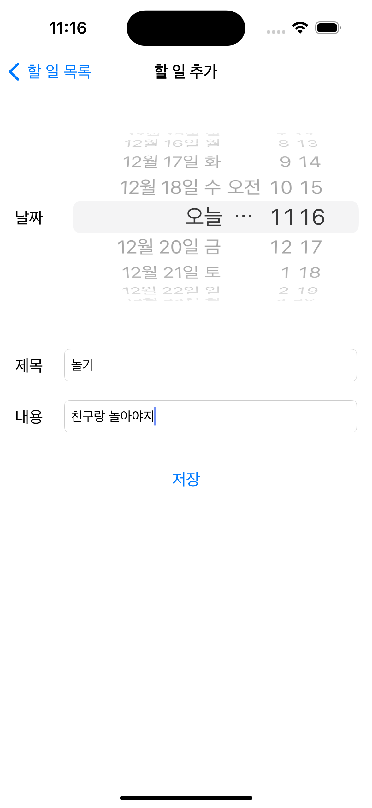
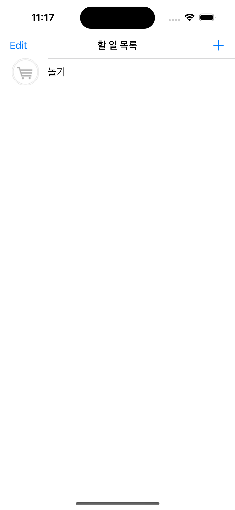
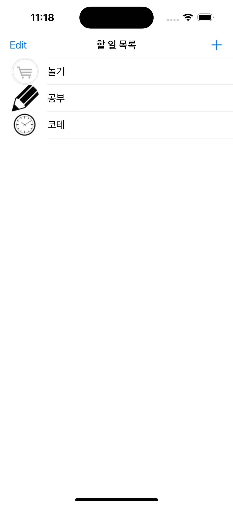
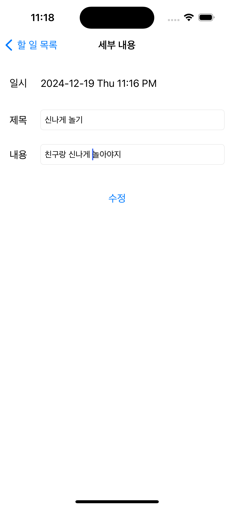
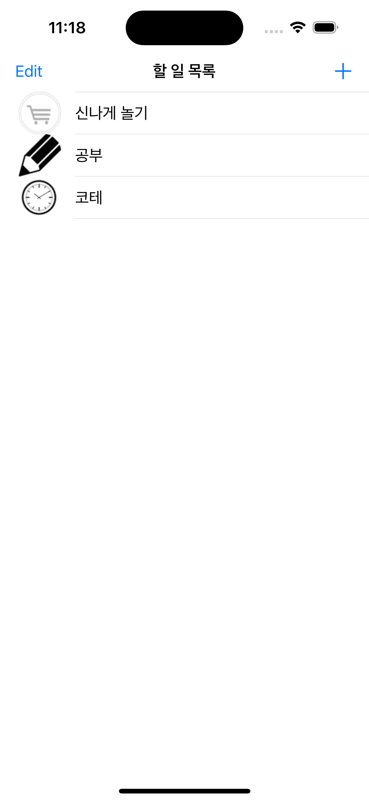
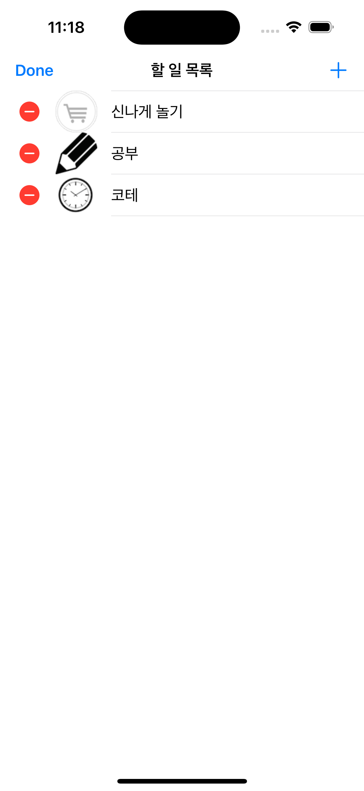
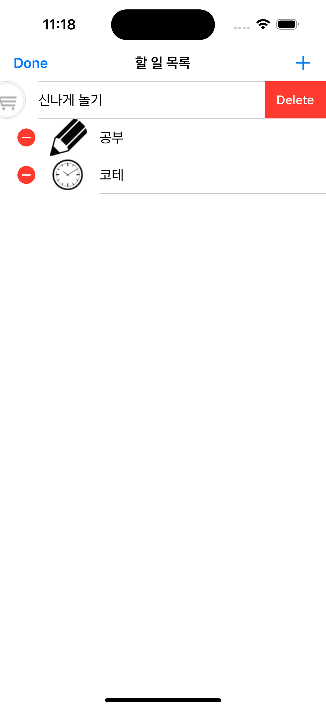
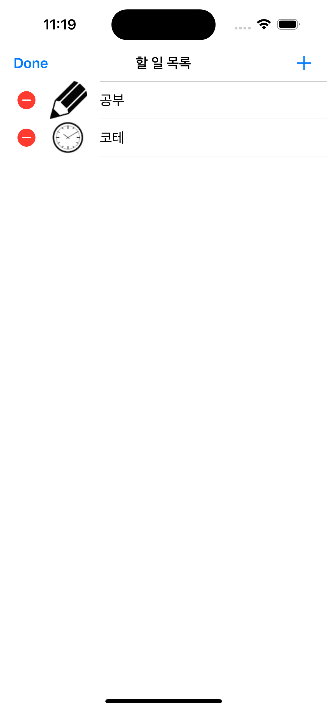

# MyDiaryApp
[ MyDiaryApp ] - 산학협력프로젝트(iOS) 최종 프로젝트

## 구현 영상
https://github.com/user-attachments/assets/e7000ee0-1c7f-468c-ab4a-5e3b06bd7cf2

 
 
<h2>초기 실행 화면 (전체 항목 보기) </h2>
<ul>
    <li> 초기 화면 </li>
</ul>
 

  

 
 

<h2> 할일 목록 추가 </h2>

<b> 초기 화면에서 + 클릭 </b>

<ul>
    <li> 날짜 입력 </li>
    <li> 제목 입력 </li>
    <li> 내용 입력 </li>
    <li> 입력 결과 </li>
</ul>
 

  
  <a> &nbsp </a>
  <a> &nbsp </a>
  <a> &nbsp </a>
  
  <a> &nbsp </a>
  <a> &nbsp </a>
  <a> &nbsp </a>
  

 
 

<h2> 할일 수정 </h2>

<b> 항목 클릭 </b>

<ul>
    <li> 할일 수정 화면 </li>
    <li> 수정 완료 화면 </li>
</ul>
 

  
  <a> &nbsp </a>
  <a> &nbsp </a>
  <a> &nbsp </a>
  

 
 

<h2> 할일 삭제 </h2>

<b> Edit 버튼 클릭 </b>

 

  
  <a> &nbsp </a>
  <a> &nbsp </a>
  <a> &nbsp </a>
  
  <a> &nbsp </a>
  <a> &nbsp </a>
  <a> &nbsp </a>
  

 
  
